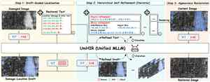
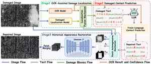
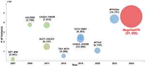

# 你好，我是张宇一 👋

**华南理工大学博士生**

探索视觉文档的读取、理解、生成与修复。

[学术主页](https://zzxf11.github.io/) · [Google Scholar](https://scholar.google.com/citations?user=KBJ9ooAAAAAJ) · [邮箱](mailto:yuyi.zhang11@foxmail.com)

[English](https://github.com/ZZXF11/ZZXF11) | **简体中文**

### 🔬 关于我

我目前是**华南理工大学博士生**，师从[金连文教授](http://dlvc-lab.net/lianwen/)，所在实验室为[深度学习与视觉计算实验室](https://github.com/SCUT-DLVCLab)。

我的研究方向包括**文档智能、计算机视觉与多模态学习**，目前重点关注：

- **多模态 OCR 大模型**：复杂视觉文档的识别与理解。
- **AIGC**：视觉文本生成、编辑与文档内容创作。
- **文档修复**：历史文档文字内容与视觉外观的恢复。

### 🚀 代表性开源项目

<table>
<tr>
<td width="32%"></td>
<td><h3><a href="https://github.com/ZZXF11/UniHIR">UniHIR</a></h3>
<strong>ACL 2026 Main</strong> · 多模态修复

通过草拟、校验与修复，实现基于统一多模态大模型的自迭代历史铭文修复。

<a href="https://aclanthology.org/2026.acl-long.1254/">论文</a> · <a href="https://github.com/ZZXF11/UniHIR">代码</a> · <a href="https://www.modelscope.cn/models/zzxfzyy/UniHIR">模型</a>
</td>
</tr>
<tr>
<td width="32%"></td>
<td><h3><a href="https://github.com/SCUT-DLVCLab/AutoHDR">AutoHDR</a></h3>
<strong>ACL 2025 Main</strong> · 整页文档修复

受历史学家工作流程启发，依次完成损伤定位、缺失文字预测与外观修复。

<a href="https://aclanthology.org/2025.acl-long.1402/">论文</a> · <a href="https://github.com/SCUT-DLVCLab/AutoHDR">代码与数据集</a>
</td>
</tr>
<tr>
<td width="32%"></td>
<td><h3><a href="https://github.com/SCUT-DLVCLab/MegaHan97K">MegaHan97K</a></h3>
<strong>Pattern Recognition 2025</strong> · OCR 基准

覆盖 97,455 个汉字类别的大规模识别数据集，包含手写、历史文档与合成数据。

<a href="https://doi.org/10.1016/j.patcog.2025.111757">论文</a> · <a href="https://github.com/SCUT-DLVCLab/MegaHan97K">数据集与代码</a>
</td>
</tr>
</table>

另有 **[HierCode](https://doi.org/10.1016/j.patcog.2024.110963)**（Pattern Recognition 2025）：用于零样本中文文本识别的轻量级层级码本。

→ [查看完整论文与项目](https://zzxf11.github.io/#publications)

### 🏆 科研与竞赛亮点

- **NTIRE 2026 · CVPR Workshop 第一名**：单图反光去除比赛，**RRay** 队。[官方结果](https://github.com/caijie0620/OpenRR-5k#-ntire-2026-sirr-challenge-leaderboard)
- **NTIRE 2025 · CVPR Workshop 第二名**：图像超分辨率（×4）比赛，**Restoration Track**，**Bbox** 队。[官方结果](https://github.com/zhengchen1999/NTIRE2025_ImageSR_x4#certificates)
- **国家奖学金**：2024 年、2022 年。

### 🎸 科研之外

我喜欢**钢琴、吉他、玩乐队与即兴伴奏**，也喜欢**足球和羽毛球**。

### 🤝 联系与合作

欢迎围绕文档智能、多模态 OCR、AIGC 与历史文档修复开展学术交流和开源合作。

📬 [yuyi.zhang11@foxmail.com](mailto:yuyi.zhang11@foxmail.com) · 🌐 [学术主页](https://zzxf11.github.io/)
